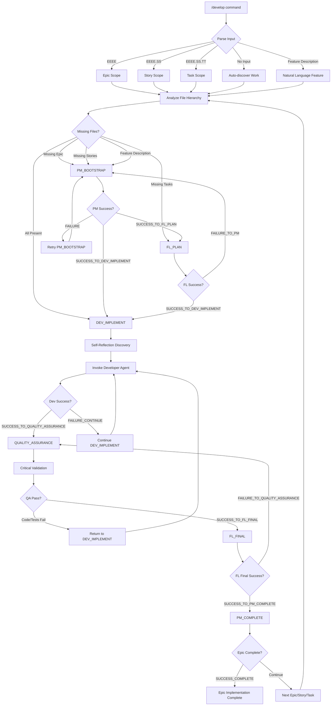
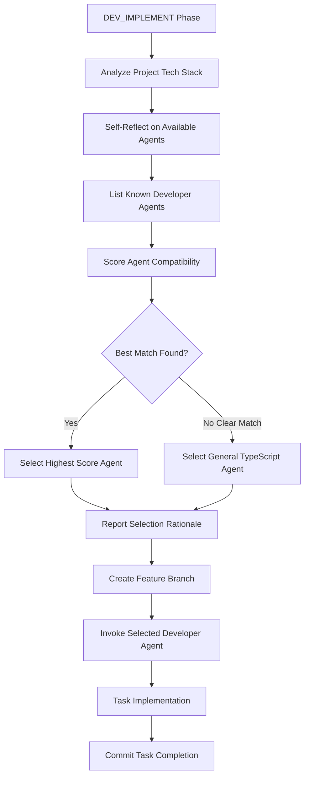
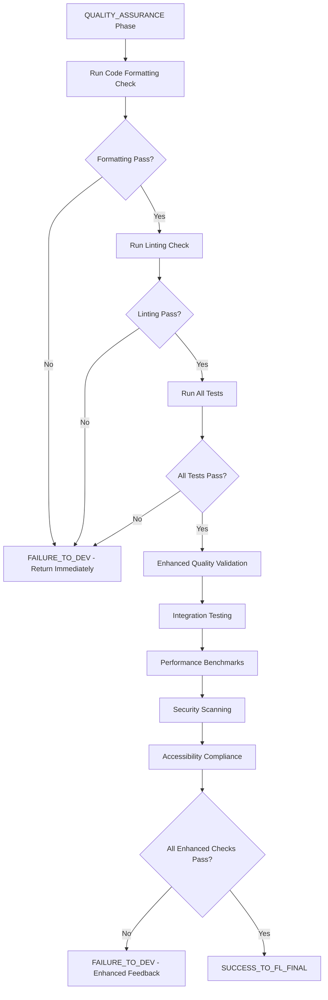
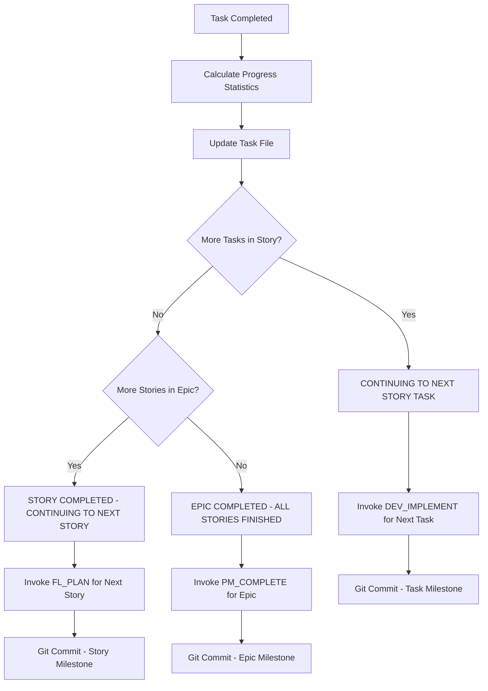

# Research Institute of Artificial Intelligence (ResIn.AI)

This project implements a sophisticated multi-agent orchestration system for complete epic implementation with progressive quality standards using Claude Code's custom slash commands.

## System Overview

**Project Type**: Claude Code Agent System  
**Purpose**: Multi-agent workflow orchestration for software development with progressive quality standards

### Core Architecture:
- **Multi-Agent System**: Project Manager, Feature Lead, Self-Reflection Developer Discovery, Quality Assurance
- **6-Stage State Machine**: PM_BOOTSTRAP → FL_PLAN → DEV_IMPLEMENT → QUALITY_ASSURANCE → FL_FINAL → PM_COMPLETE
- **Self-Reflection Agent Discovery**: Automatically selects appropriate developer agent based on internal knowledge of agent capabilities and project tech stack
- **Progressive Quality Standards**: BASE → ENHANCED → MAXIMUM → STRATEGIC
- **Hierarchical Task Management**: Epic → Story → Task with unique identifiers (EEEE.SS.TT)
- **Standardized Templates**: Consistent reporting and transition handling across all orchestration phases
- **Feature Branch Workflow**: Complete git workflow with `/branch` and `/commit` Claude Code slash command integration
- **Task-Based Branching**: Automatic feature branch creation using `feature/TASK-EEEE.SS.TT-description` pattern
- **Conventional Commits**: Automated commits with `type(EEEE.SS.TT): description` format for precise tracking

### Technical Stacks:

Developer agents are discovered through self-reflection based on project technology requirements. Each discovered agent adapts to the specific technical stack and tooling of the current project, providing specialized expertise for optimal implementation quality.

## Workflow Diagrams

### Complete Orchestration Flow



### Self-Reflection Developer Discovery Process



### Quality Assurance Decision Tree



### Task Completion Flow



---

# Commands Directory

This section contains Claude Code custom slash commands for development workflow orchestration and project management.

## Active Commands

### `/develop` (`develop.md`)
**Agentic State-Machine Orchestrator for complete epic implementation**

- **Mode**: Enters **Agentic State-Machine Orchestrator mode** - locked until user exit or completion
- **Purpose**: Orchestrates multi-agent, multi-stage state machine for epic → story → task implementation
- **Architecture**: PM_BOOTSTRAP → FL_PLAN → DEV_IMPLEMENT → QUALITY_ASSURANCE → FL_FINAL → PM_COMPLETE
- **Progressive Quality**: BASE → ENHANCED → MAXIMUM → STRATEGIC standards
- **Self-Reflection Discovery**: Uses internal knowledge for developer agent selection
- **Standardized Templates**: SELF-REFLECTION-DEVELOPER-DISCOVERY, STATE-TRANSITION, TASK-COMPLETION
- **Critical Quality Gates**: Mandatory code formatting, linting, and test validation
- **Feature Branch Workflow**: Orchestrator uses `/branch` slash command, developer uses `/commit` slash command
- **Task-Based Branching**: Creates feature branches using `feature/TASK-EEEE.SS.TT-description` naming  
- **Conventional Commits**: Both use Claude Code `/commit` slash command for auto-generated conventional commits
- **Mode Lock**: Prevents autonomous exits, phase skipping, and demonstration shortcuts
- **Usage**:
  ```bash
  /develop                # Enter orchestrator mode, auto-discover work
  /develop 0003          # Enter orchestrator mode for Epic 0003
  /develop 0003.02       # Enter orchestrator mode for Story 0003.02
  /develop 0003.02.01    # Enter orchestrator mode for Task 0003.02.01
  /develop "feature description"  # Create new epic from natural language feature description
  ```

### `/prime` (`prime.md`)
**Context loading command for comprehensive project understanding**

- **Purpose**: Prime Claude with project overview, structure, and development context
- **Features**: README analysis, file structure review, configuration understanding, comprehensive status reporting
- **Output**: Detailed project status report with technology stack, architecture highlights, and development context
- **Usage**: `/prime` - Load complete project context

### `/framework` (`framework.md`)
**Comprehensive technical architect assistant for new project creation**

- **Purpose**: Comprehensive technical architect assistant for designing and planning entirely new projects from the ground up
- **Features**: Requirements discovery, technology stack recommendations, architecture design, epic-level planning, implementation roadmap
- **Process**: Discovery → Technology Stack → Architecture Design → Documentation → Epic Planning → Progress Tracking Setup
- **Output**: Complete project blueprint with documentation structure and epic-based development plan
- **Usage**: `/framework` - Enter Framework Mode for greenfield project creation

### Utility Commands

#### `/ask` (`ask.md`)
- **Purpose**: AI-powered question answering and research
- **Usage**: `/ask [question]` - Get intelligent responses with web search capability

#### `/branch` (`branch.md`)
- **Purpose**: Git branch management and workflow operations
- **Usage**: `/branch [branch-name]` - Create and manage feature branches

#### `/commit` (`commit.md`)
- **Purpose**: Intelligent commit message generation and git operations
- **Features**: Conventional commit format, pre-commit checks, automatic staging
- **Usage**: `/commit [--no-verify]` - Stage changes and create commits with proper formatting

#### `/docs` (`docs.md`)
- **Purpose**: Documentation generation and maintenance
- **Usage**: `/docs` - Generate or update project documentation

## Command Architecture

### Agentic State-Machine Orchestrator (`/develop`)
The `/develop` command operates in **Agentic State-Machine Orchestrator mode**:
- **Mode Lock**: Claude locked in orchestrator mode until user exit or completion
- **Single Command**: Handles Epic → Story → Task hierarchy with automatic progression
- **Multi-Agent Quality Progression**: Project Manager → Feature Lead → Developer → Quality Assurance
- **6-Stage State Machine**: Complete workflow from planning to strategic completion
- **Progressive Quality Standards**: Each phase applies increasingly strict standards
- **Self-Reflection Agent Discovery**: Internal knowledge-based developer agent selection
- **Standardized Templates**: Consistent reporting and state transition handling
- **Critical Quality Validation**: Mandatory formatting, linting, and test requirements
- **Anti-Early-Exit**: Prevents autonomous phase skipping and demonstration shortcuts
- **Hierarchical Identifier Support**: Works with EPIC, STORY, or TASK identifiers
- **Conditional Bootstrapping**: Only creates missing files as needed
- **Complete Task Tree Maintenance**: Updates all hierarchy files
- **Automatic Git Integration**: Creates meaningful commits at key milestones

### Quality Standards Progression

1. **Developer (BASE)**: Standard technical implementation and testing
2. **Quality Assurance (ENHANCED)**: Through-the-roof comprehensive validation with critical requirements
3. **Feature Lead (MAXIMUM)**: Ruthless business validation
4. **Project Manager (STRATEGIC)**: Complete epic coherence validation

### File Hierarchy Management

Commands work with structured file hierarchy:
```
docs/DEVELOPMENT_PLAN_AND_PROGRESS/
├── EEEE - Epic Name.md                                 # Epic files
├── EEEE.SS - Epic Name - Story Name.md                 # Story files
└── EEEE.SS.TT - Epic Name - Story Name - Task Name.md  # Task files
```

## State Persistence

All commands maintain state in:
- **Main Progress**: `docs/DEVELOPMENT_PLAN_AND_PROGRESS.md` with agentic state tracking
- **Hierarchy Files**: Epic, Story, and Task files with completion status
- **Iteration Tracking**: Failure reasons and retry counts
- **Quality Documentation**: Standards applied at each phase
- **Time Stamps**: All state transitions across file hierarchy
- **Git History**: Automatic commits with meaningful messages at milestones

---

# Agents Directory

This section documents the specialized sub-agents used by the `/develop` orchestrator command for complete epic implementation with progressive quality standards and intelligent tech stack detection.

## Multi-Agent Architecture

### Agent 1: Project Manager (`project-manager`)
- **Role**: Strategic planning and completion specialist
- **Phases**: PM_BOOTSTRAP, PM_COMPLETE
- **Quality Standards**: STRATEGIC oversight
- **Expertise**: Epic analysis, story breakdown, strategic validation
- **Responsibilities**:
  - Analyze epics and create story breakdowns
  - Complete epic implementation with strategic coherence validation
  - Portfolio alignment and resource utilization optimization
- **Return Codes**: SUCCESS_TO_FL_PLAN, SUCCESS_TO_DEV_IMPLEMENT, SUCCESS_COMPLETE, FAILURE_EPIC_SCOPE, CRITICAL_FAILURE

### Agent 2: Feature Lead (`feature-lead`)
- **Role**: Business task planning and validation specialist
- **Phases**: FL_PLAN, FL_FINAL
- **Quality Standards**: MAXIMUM business standards
- **Expertise**: Business planning, user experience validation, stakeholder acceptance
- **Responsibilities**:
  - Create task implementation plans for all stories
  - Final business validation with ruthless business standards
  - User journey validation and stakeholder acceptance
- **Return Codes**: SUCCESS_TO_DEV_IMPLEMENT, SUCCESS_TO_PM_COMPLETE, FAILURE_TO_PM, FAILURE_TO_QUALITY_ASSURANCE, CRITICAL_FAILURE

### Agent 3: Developer (Self-Reflection Discovery)
- **Role**: Self-reflection based discovery and selection of developer agents based on project tech stack and agent expertise
- **Phases**: DEV_IMPLEMENT (All project types)
- **Quality Standards**: BASE technical standards
- **Discovery Process**: 
  - Uses self-reflection to discover available developer agent capabilities
  - Matches discovered agent descriptions against project technology requirements
  - Selects highest compatibility score agent through internal contemplation
  - Uses SELF-REFLECTION-DEVELOPER-DISCOVERY template for consistent reporting
- **Dynamic Discovery**: Available developer agents discovered through self-reflection and internal knowledge
- **Specialized Agents**: Includes Tauri desktop application specialist, TypeScript generalist, and other technology-specific experts
- **Task Completion**: Uses TASK-COMPLETION template for progress reporting with dual story/epic tracking
- **Extensible**: New developer agents automatically discoverable through enhanced self-reflection
- **Return Codes**: SUCCESS_TO_QUALITY_ASSURANCE, FAILURE_CONTINUE, PARTIAL_SUCCESS, TIMEOUT_CONTINUE

### Agent 4: Quality Assurance (`quality-assurance`)
- **Role**: Enhanced quality validation specialist
- **Phases**: QUALITY_ASSURANCE
- **Quality Standards**: ENHANCED (through-the-roof) standards
- **Critical Requirements**:
  - **Code formatting and linting MUST pass** without any errors
  - **All tests MUST pass** without exception
  - **NEVER fix any errors** - only test and validate
  - **Return to DEV_IMPLEMENT immediately** if formatting, linting, or tests fail
- **Expertise**: Comprehensive testing, security validation, performance benchmarking
- **Responsibilities**:
  - Enhanced quality validation far exceeding Developer standards
  - Integration testing, security scanning, accessibility compliance
  - Performance benchmarking and regression testing
- **Return Codes**: SUCCESS_TO_FL_FINAL, FAILURE_TO_DEV, ENHANCEMENT_REQUIRED, CRITICAL_FAILURE

## 6-Stage State Machine Flow

```
PM_BOOTSTRAP → FL_PLAN → DEV_IMPLEMENT → QUALITY_ASSURANCE → FL_FINAL → PM_COMPLETE
   (Agent 1)   (Agent 2)    (Agent 3)        (Agent 4)      (Agent 2)   (Agent 1)
                   ↑           ↓  ↑              ↓  ↑           ↓  ↑        ↓
                   └───────────┘  └──────────────┘  └───────────┘  └────────┘
                   (FL fails,     (QA fails,        (FL fails,     (PM fails,
                    return to      return to         return to      return to
                    FL_PLAN)       DEV_IMPLEMENT)    QA)            FL_FINAL)
```

## Progressive Quality Standards

Each agent applies increasingly strict quality standards:

1. **Developer (BASE)**: Standard implementation and testing
2. **Quality Assurance (ENHANCED)**: Comprehensive validation with critical formatting/testing requirements
3. **Feature Lead (MAXIMUM)**: Business value and user experience validation
4. **Project Manager (STRATEGIC)**: Epic coherence and portfolio alignment

## Agent Specialization

### What Each Agent DOES Understand:
- **Project Manager**: Strategic planning, epic coherence, portfolio alignment
- **Feature Lead**: Business requirements, user experience, stakeholder validation
- **Developer**: Technical implementation, code architecture, testing frameworks
- **Quality Assurance**: Quality standards, testing methodologies, performance validation, critical validation gates

### What Each Agent DOES NOT Understand:
- **Project Manager**: Technical implementation details, code specifics
- **Feature Lead**: Technical architecture, programming languages, development tools
- **Developer**: Business strategy, user experience, market considerations
- **Quality Assurance**: Business requirements, strategic planning, user workflows

## Standardized Templates

The orchestrator uses three main templates for consistent operation:

### SELF-REFLECTION-DEVELOPER-DISCOVERY
- **Purpose**: Consistent developer agent selection and reporting
- **Features**: Technology analysis, agent scoring, selection rationale
- **Requirements**: List all agents, show scoring, clear selection reasoning

### STATE-TRANSITION  
- **Purpose**: Consistent phase transition reporting with hierarchical context
- **Features**: Epic/Story/Task context, return codes, transition descriptions
- **Supports**: Forward transitions, same-state retries, agent continuation, full hierarchy tracking

### TASK-COMPLETION
- **Purpose**: Task completion reporting with progress tracking
- **Features**: Dual progress tracking (story + epic), next action determination
- **Transitions**: Task → Task, Task → Story, Task → Epic completion

## Agentic State-Machine Orchestrator Mode

When `/develop` is invoked, Claude enters **Agentic State-Machine Orchestrator mode** and remains locked in this mode until explicitly requested to exit by the user. This prevents autonomous mode switching and early exits.

### Mode Lock Features:
- **Continuous Orchestration**: Must complete all 6 stages or receive user intervention
- **No Autonomous Exits**: Cannot exit for demonstration or explanation purposes
- **Strict Phase Adherence**: Each agent must complete their phase fully
- **Template Compliance**: All reporting uses standardized templates
- **Critical Quality Gates**: Mandatory validation checkpoints
- **Git Integration**: Automatic commits at milestones
- **Mode Discipline**: No switching to tutorial, demo, or other modes

### Mode Lock Rules:
- **LOCKED MODE**: Claude enters Agentic State-Machine Orchestrator mode and cannot exit autonomously
- **NO MODE SWITCHING**: Cannot switch to demonstration, explanation, or tutorial modes
- **CONTINUOUS ORCHESTRATION**: Must complete all 6 stages or receive user intervention
- **NO PHASE SKIPPING**: Commands cannot skip phases for demonstration purposes
- **COMPLETE IMPLEMENTATION**: Each phase must finish fully before proceeding
- **STRICT RETURN CODES**: Only documented state transitions allowed
- **TEMPLATE ADHERENCE**: All reporting must use standardized templates
- **CRITICAL VALIDATION**: Quality Assurance must validate formatting, linting, and tests
- **NO AUTONOMOUS DECISIONS**: Commands follow orchestrator control only

### Prohibited Behaviors:
- ❌ "Given the iterative nature... let me move forward to show the complete workflow"
- ❌ "This is a demonstration of orchestrator capabilities"
- ❌ Autonomous mode switching or early exits
- ❌ Phase skipping for any reason except documented failure states
- ❌ Fixing errors during Quality Assurance phase
- ❌ Skipping critical validation requirements

## File Structure

Each agent file contains:
- **Metadata**: name, description, tools, color
- **Professional Role**: Expertise and limitations
- **Implementation Approach**: Phase-specific methodology
- **Quality Gates**: Standards and validation criteria
- **Handoff Protocol**: Inter-agent communication
- **Return Codes**: State transition signals
- **Template Usage**: Required template compliance

## Mode Exit Protocol

### Permitted Exits:
- ✅ **User explicitly requests exit**: "Exit orchestrator mode", "Stop develop"
- ✅ **Complete epic implementation**: All 6 stages successfully completed through PM_COMPLETE
- ✅ **Critical system failure**: Agent returns CRITICAL_FAILURE requiring user intervention

### Prohibited Autonomous Exits:
- ❌ **Demonstration purposes**: "Let me show the complete workflow"
- ❌ **Iterative reasoning**: "Given the iterative nature..."
- ❌ **Mode switching**: Switching to explanation, tutorial, or any other mode
- ❌ **Self-termination**: Any autonomous decision to end orchestration
- ❌ **Phase skipping**: Jumping ahead to demonstrate later phases

### Agent Behavioral Rules:
- Complete their phase fully before returning control
- Use only documented return codes
- Follow required template formats
- Never skip phases or make autonomous workflow decisions
- Never transition early for "demonstration" purposes
- Focus solely on their specialized domain expertise
- Maintain mode lock throughout their execution
- Quality Assurance must never fix errors, only validate

---

## Usage Patterns

### Development Workflow
```bash
/prime                              # Load project context
/develop 0003                       # Enter orchestrator mode for Epic 0003
# Claude now locked in orchestrator mode until completion or user exit

# Git workflow automatically handled:
# - Orchestrator uses /branch slash command to create feature branch before each task
# - Developer uses /commit slash command during implementation (auto-generates conventional commits)
# - Orchestrator uses /commit slash command for final documentation updates
# - Orchestrator merges feature branch into main using standard git merge commands
# - Story/Epic milestone commits using /commit slash command
```

### Project Setup
```bash
/framework               # Enter Framework Mode for new project creation
# Complete greenfield project planning and architecture design
/develop 0001           # Begin implementation of first epic from framework plan
# Automatic commits throughout implementation process
```

### Research and Planning
```bash
/ask "Best practices for Next.js authentication"
/prime                   # Refresh context with new information
/develop 0004            # Apply research to new epic
```

### Quality Assurance Focus
```bash
/develop 0005           # Epic with strict quality requirements
# Quality Assurance phase will:
# - Validate code formatting (zero errors)
# - Validate all tests pass (100% success)
# - Return to DEV_IMPLEMENT if any critical validation fails
# - Perform comprehensive enhanced validation only after critical checks pass
```

### Natural Language Feature Development
```bash
# Create and implement new features from natural language descriptions
/develop "Add user authentication with OAuth2 and role-based permissions"
# Creates new epic from feature description, starts with PM_BOOTSTRAP phase
# Project Manager analyzes feature and breaks into stories and tasks
# Automatic progression through all 6 stages with quality validation

/develop "Implement real-time chat feature with message history"
# Another feature-driven epic that starts from planning
# Self-reflection agent discovery selects appropriate developer based on tech requirements

/develop "Build responsive dashboard with data visualization charts"
# Complex UI feature that triggers appropriate specialist selection
# Complete implementation with progressive quality standards
```

## Command Development

New commands should follow the established patterns:
- Clear purpose and scope definition
- Integration with file hierarchy system
- Proper state persistence and tracking
- Progressive quality standard enforcement
- Agentic State-Machine Orchestrator mode compliance
- Anti-early-exit behavioral controls with mode lock enforcement
- Standardized template usage for consistent reporting
- Critical validation checkpoint implementation
- Automatic git integration for milestone tracking