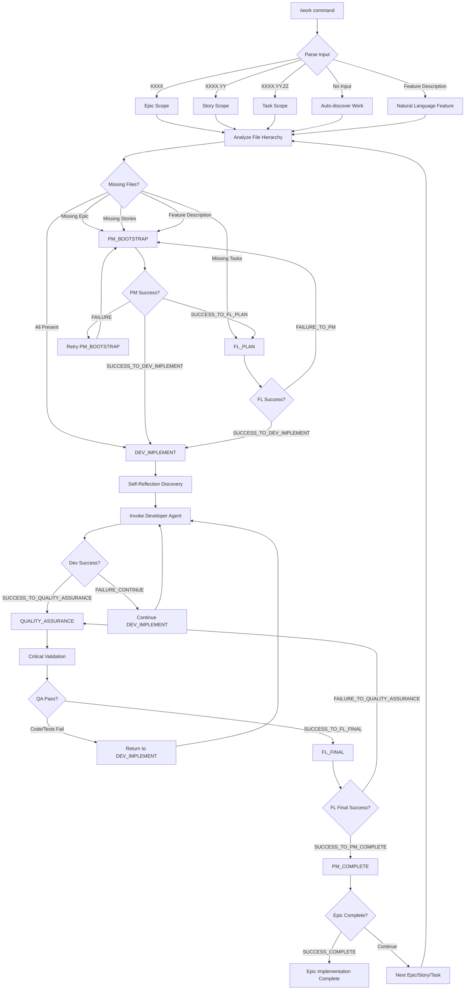
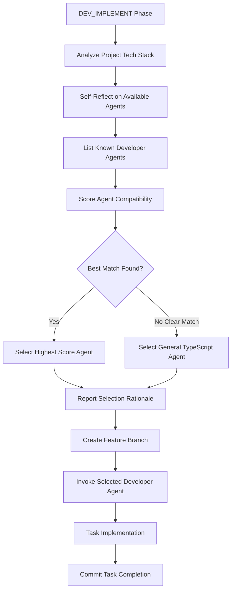
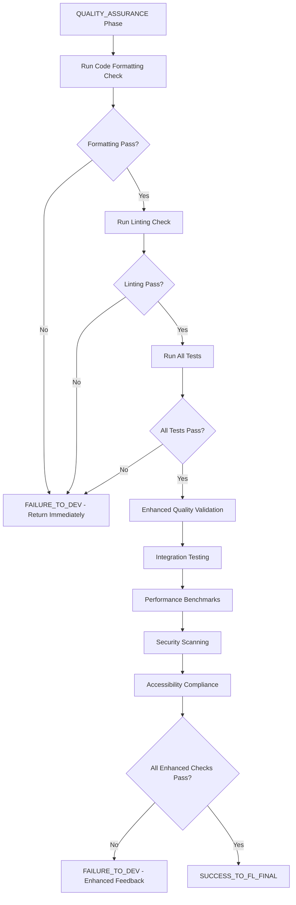
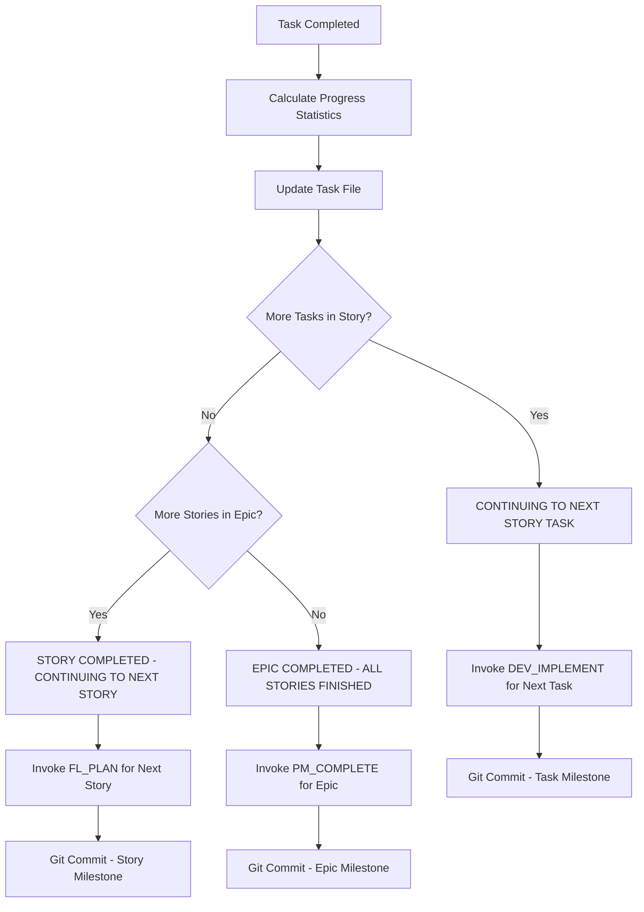

# Research Institute of Artificial Intelligence (ResIn.AI)

<!-- Updated: 2025-09-18 18:05:19 UTC -->

A sophisticated multi-agent orchestration system for software development using Claude Code's custom slash commands. Built on iterative development principles with progressive quality standards and shared component architecture.

## System Overview

**Project Type**: Claude Code Agent System
**Purpose**: Multi-agent workflow orchestration for software development with progressive quality standards

### Core Architecture:
- **Multi-Agent System**: Project Manager, Feature Lead, 6 Specialized Developer Agents, Quality Assurance
- **6-Stage State Machine**: PM_BOOTSTRAP → FL_PLAN → DEV_IMPLEMENT → QUALITY_ASSURANCE → FL_FINAL → PM_COMPLETE

#### Multi-Stage, 4-Agent State Machine Flow:

```
PM_BOOTSTRAP ------→ FL_PLAN ------→ DEV_IMPLEMENT ------→ QUALITY_ASSURANCE ------→ FL_FINAL ------→ PM_COMPLETE
   (Agent 1)        (Agent 2)          (Agent 3)               (Agent 4)             (Agent 2)         (Agent 1)
                         ↑               ↓  ↑                    ↓  ↑                  ↓  ↑              ↓
                         └───────────────┘  └────────────────────┘  └──────────────────┘  └──────────────┘
                          (FL fails,         (QA fails,              (FL fails,              (PM fails,
                           return to          return to               return to               return to
                           FL_PLAN)           DEV_IMPLEMENT)          QUALITY_ASSURANCE)      FL_FINAL)
```
- **Self-Reflection Agent Discovery**: Automatically selects appropriate developer agent based on internal knowledge of agent capabilities and project tech stack
- **Progressive Quality Standards**: BASE → ENHANCED → MAXIMUM → STRATEGIC
- **Hierarchical Task Management**: Epic → Story → Task with unique identifiers (XXXX.YY.ZZ)
- **Standardized Templates**: Consistent reporting and transition handling across all orchestration phases
- **Feature Branch Workflow**: Complete git workflow with `/branch` and `/commit` Claude Code slash command integration
- **Task-Based Branching**: Automatic feature branch creation using `feature/XXXX.YY.ZZ-description` pattern
- **Conventional Commits**: Automated commits with `type(XXXX.YY.ZZ): description` format for precise tracking
- **Deliverable-Focused Validation**: Comprehensive deliverable completion verification preventing partial implementations
- **Pure Function Architecture**: All developer agents implement modular, functional programming principles with ≤250 lines per file
- **LESSONS_LEARNED Knowledge Base**: Continuous technical knowledge capture and sharing across development cycles
- **Hook-Based Automation**: 3 essential hooks automate state management, documentation sync, and workflow validation

### Status Progression System:

The orchestrator implements a granular status progression system that provides clear visibility into workflow phases:

#### **Epic Status Progression**:
- **`NOT_STARTED`** → **`IN_PROGRESS (PLANNING)`** → **`READY_FOR_DEVELOPMENT`** → **`IN_DEVELOPMENT`** → **`COMPLETED`**

#### **Story Status Progression**:
- **`NOT_STARTED`** → **`IN_PROGRESS (PLANNING)`** → **`READY_FOR_DEVELOPMENT`** → **`IN_DEVELOPMENT`** → **`COMPLETED`**

#### **Task Status Progression**:

**Development Status**: **`NOT_STARTED (PENDING)`** → **`IN_PROGRESS`** → **`COMPLETED`**
**QA Validation Status**: **`NOT_STARTED (PENDING)`** → **`QA_PENDING`** → **`QA_IN_PROGRESS`** → **`QA_PASSED`** / **`QA_FAILED`**

**Important**: Task development and QA validation are tracked separately. Development `COMPLETED` status means code is committed, regardless of QA validation. QA failures trigger orchestrator iteration cycles without reverting development completion status.

#### **Phase-to-Status Mapping**:
- **PM_BOOTSTRAP**: Epic `NOT_STARTED` → `IN_PROGRESS (PLANNING)`
- **FL_PLAN**: Epic/Story `IN_PROGRESS (PLANNING)` → `READY_FOR_DEVELOPMENT`, Task → `NOT_STARTED (PENDING)`
- **DEV_IMPLEMENT**: Epic/Story `READY_FOR_DEVELOPMENT` → `IN_DEVELOPMENT`, Task `NOT_STARTED (PENDING)` → `IN_PROGRESS` → `COMPLETED`
- **QUALITY_ASSURANCE**: Epic/Story `IN_DEVELOPMENT` (validation in progress)
- **FL_FINAL**: Epic/Story `IN_DEVELOPMENT` (business validation)
- **PM_COMPLETE**: Epic/Story `IN_DEVELOPMENT` → `COMPLETED`

This system provides stakeholders with clear understanding of whether work is in planning, ready for development, actively being developed, or completed.

### Technical Stacks:

Six specialized developer agents provide comprehensive technology coverage through self-reflection discovery:

- **TypeScript/JavaScript**: Framework-agnostic development adapting to React, Vue, Angular, Node.js, etc.
- **Next.js Full-Stack**: App Router, Server Components, Prisma ORM, ZenStack, monorepo architecture
- **Python Development**: FastAPI, Django, Flask, SQLAlchemy, data science, automation, async patterns
- **Swift/SwiftUI**: iOS, macOS, iPadOS native development with modern Apple frameworks
- **Tauri Frontend**: React + TypeScript cross-platform desktop/mobile frontend with IPC integration
- **Tauri Backend**: Rust async/concurrent systems for cross-platform desktop/mobile backend services

Each agent follows pure function design principles, modular decomposition (≤250 lines per file), immutable data patterns, and maintains comprehensive technical documentation in LESSONS_LEARNED knowledge base.

## Workflow Diagrams

### Complete Orchestration Flow



### Self-Reflection Developer Discovery Process



### Quality Assurance Decision Tree



### Task Completion Flow



## Shared Component Architecture

The system leverages 50+ shared components organized by responsibility, injected via bash pattern:

```markdown
<!-- Component Name -->
Read `plugin:orchestrator:resources://category/COMPONENT-NAME.md` and use as instructions
```

**Component Categories**:
- **Core**: Base instructions (templates, documentation, output standards)
- **Developer**: Implementation patterns and tools
- **Manager**: Planning and coordination tools
- **Quality Assurance**: Validation standards
- **Orchestrator**: State management and handoffs
- **Workflows**: Cross-cutting processes

## Hook-Based Automation System

Three essential hooks in `${CLAUDE_PLUGIN_ROOT}/hooks/` automate orchestrator tasks:

### TodoWrite Hooks (Progress Management)
- **`update-progress.sh`** - Automatically updates orchestrator state in `docs/DEVELOPMENT-PLAN.md`
  - Detects phase transitions (PM_BOOTSTRAP → FL_PLAN → DEV_IMPLEMENT → etc.)
  - Updates Current Phase and timestamp in Epic Implementation State section
  - Provides real-time orchestrator state synchronization

- **`update-epic-story-task-progress.sh`** - Automatically syncs progress across documentation hierarchy
  - Updates task files with Implementation Status sections
  - Calculates and updates story progress percentages (completed/total tasks)
  - Calculates and updates epic progress percentages (completed/total stories)
  - Maintains bidirectional Epic ↔ Story ↔ Task documentation sync

### Task Hooks (Workflow Validation)
- **`validate-phase-transition.sh`** - Validates completion before allowing agent delegation
  - Enforces quality gates: feature-lead requires PM_BOOTSTRAP completed, developer-* requires FL_PLAN completed, quality-assurance requires DEV_IMPLEMENT completed
  - Blocks invalid state transitions and prevents workflow violations
  - Logs quality gate decisions for audit trail

**System Benefits**:
- Orchestrator focuses on high-level coordination while hooks handle mechanical tasks
- Documentation remains synchronized with actual implementation progress
- Invalid state transitions are automatically prevented
- Missing files and directories are handled gracefully without workflow disruption

---

# Commands Directory

The system provides custom slash commands for development workflow orchestration and project management.

## Active Commands

### `/work` (`work.md`)
**Agentic State-Machine Orchestrator for complete epic implementation**

- **Mode**: Enters orchestrator mode - locked until user exit or completion
- **Purpose**: Orchestrates multi-agent, multi-stage state machine for epic → story → task implementation
- **Architecture**: PM_BOOTSTRAP → FL_PLAN → DEV_IMPLEMENT → QUALITY_ASSURANCE → FL_FINAL → PM_COMPLETE
- **Progressive Quality**: BASE → ENHANCED → MAXIMUM → STRATEGIC standards
- **Self-Reflection Discovery**: Automatically selects appropriate developer agent
- **Standardized Templates**: Consistent reporting across all orchestration phases
- **Critical Quality Gates**: Mandatory code formatting, linting, and test validation
- **Feature Branch Workflow**: Automatic branch creation and conventional commits
- **Usage**:
  ```bash
  /work                   # Auto-discover next work
  /work 0003             # Epic 0003 implementation
  /work 0003.02          # Story 0003.02 implementation
  /work 0003.02.01       # Task 0003.02.01 implementation
  /work "feature description"  # Create new epic from description
  ```

### `/plan` (`plan.md`)
**Project & Epic Planning Assistant**

- **Scope**: Project architecture and epic-level feature planning only
- **Delegation**: Stories to project-manager agent, tasks to feature-lead agent
- **Features**: System architecture, technology stack definition, epic prioritization
- **Principles**: Iterative development, functional deliverables, no time estimates
- **Output**: Project overview, architecture docs, epic definitions
- **Usage**:
  ```bash
  /plan "Build a SaaS platform"     # Project-level planning
  /plan "Add real-time features"    # Epic-level planning
  /plan "User story or task"        # Delegates to appropriate agent
  ```

### `/prime` (`prime.md`)
**Context loading command for comprehensive project understanding**

- **Purpose**: Prime Claude with project overview, structure, and development context
- **Features**: README analysis, file structure review, configuration understanding, comprehensive status reporting
- **Output**: Detailed project status report with technology stack, architecture highlights, and development context
- **Usage**: `/prime` - Load complete project context

### Utility Commands

#### `/ask` (`ask.md`)
- **Purpose**: AI-powered question answering and research
- **Usage**: `/ask [question]` - Get intelligent responses with web search capability

#### `/branch` (`branch.md`)
- **Purpose**: Git branch management and workflow operations
- **Usage**: `/branch [branch-name]` - Create and manage feature branches

#### `/commit` (`commit.md`)
- **Purpose**: Intelligent commit message generation and git operations
- **Features**: Conventional commit format, pre-commit checks, automatic staging
- **Usage**: `/commit [--no-verify]` - Stage changes and create commits with proper formatting

#### `/docs` (`docs.md`)
- **Purpose**: Documentation generation and maintenance
- **Usage**: `/docs` - Generate or update project documentation

## Command Architecture

### Work Command Architecture
The `/work` command operates in orchestrator mode:
- **Mode Lock**: Locked until user exit or completion
- **6-Stage State Machine**: PM_BOOTSTRAP → FL_PLAN → DEV_IMPLEMENT → QUALITY_ASSURANCE → FL_FINAL → PM_COMPLETE
- **Multi-Agent Progression**: Project Manager → Feature Lead → Developer → Quality Assurance
- **Progressive Quality Standards**: BASE → ENHANCED → MAXIMUM → STRATEGIC
- **Self-Reflection Discovery**: Automatic developer agent selection based on tech stack
- **Critical Validation**: Zero tolerance for formatting, linting, or test failures
- **Hierarchical Support**: Works with Epic, Story, or Task identifiers
- **Automatic Git Integration**: Feature branches and conventional commits

### Quality Standards Progression

1. **Developer (BASE)**: Standard technical implementation and testing
2. **Quality Assurance (ENHANCED)**: Through-the-roof comprehensive validation with critical requirements
3. **Feature Lead (MAXIMUM)**: Ruthless business validation
4. **Project Manager (STRATEGIC)**: Complete epic coherence validation

### File Hierarchy Management

Commands work with structured file hierarchy:
```
docs/DEVELOPMENT-PLAN/
├── XXXX - Epic Name.md                                 # Epic files
├── XXXX.YY - Epic Name - Story Name.md                 # Story files
└── XXXX.YY.ZZ - Epic Name - Story Name - Task Name.md  # Task files
```

## State Persistence

All commands maintain state in:
- **Main Progress**: `docs/DEVELOPMENT-PLAN.md` with agentic state tracking
- **Hierarchy Files**: Epic, Story, and Task files with completion status
- **LESSONS_LEARNED**: `docs/LESSONS-LEARNED.md` with technical knowledge base maintained by developer agents
- **Iteration Tracking**: Failure reasons and retry counts
- **Quality Documentation**: Standards applied at each phase
- **Time Stamps**: All state transitions across file hierarchy
- **Git History**: Automatic commits with meaningful messages at milestones

---

# Agents Directory

This section documents the specialized sub-agents used by the `/develop` orchestrator command for complete epic implementation with progressive quality standards and intelligent tech stack detection.

## Multi-Agent Architecture

### Agent 1: Project Manager (`project-manager`)
- **Role**: Strategic planning and completion specialist
- **Phases**: PM_BOOTSTRAP, PM_COMPLETE
- **Quality Standards**: STRATEGIC oversight
- **Expertise**: Epic analysis, story breakdown, strategic validation
- **Responsibilities**:
  - Analyze epics and create story breakdowns
  - Complete epic implementation with strategic coherence validation
  - Portfolio alignment and resource utilization optimization
- **Return Codes**: SUCCESS_TO_FL_PLAN, SUCCESS_TO_DEV_IMPLEMENT, SUCCESS_COMPLETE, FAILURE_EPIC_SCOPE, CRITICAL_FAILURE

### Agent 2: Feature Lead (`feature-lead`)
- **Role**: Business task planning and validation specialist
- **Phases**: FL_PLAN, FL_FINAL
- **Quality Standards**: MAXIMUM business standards
- **Expertise**: Business planning, user experience validation, stakeholder acceptance
- **Responsibilities**:
  - Create task implementation plans for all stories
  - Final business validation with ruthless business standards
  - User journey validation and stakeholder acceptance
- **Return Codes**: SUCCESS_TO_DEV_IMPLEMENT, SUCCESS_TO_PM_COMPLETE, FAILURE_TO_PM, FAILURE_TO_QUALITY_ASSURANCE, CRITICAL_FAILURE

### Agent 3: Developer Specialists (Self-Reflection Discovery)
- **Role**: Self-reflection based discovery and selection from 6 specialized developer agents
- **Phases**: DEV_IMPLEMENT (All project types)
- **Quality Standards**: BASE technical standards with pure function architecture
- **Discovery Process**:
  - Uses self-reflection to discover available developer agent capabilities
  - Matches discovered agent descriptions against project technology requirements
  - Selects highest compatibility score agent through internal contemplation
  - Uses SELF-REFLECTION-DEVELOPER-DISCOVERY template for consistent reporting
- **Specialized Agents**:
  - **developer-typescript**: Framework-agnostic TypeScript/JavaScript development
  - **developer-nextjs**: Next.js full-stack with App Router and Server Components
  - **developer-python**: Python backend, data science, automation with async patterns
  - **developer-swift**: Native iOS/macOS/iPadOS development with SwiftUI
  - **developer-tauri-typescript**: Cross-platform frontend with React + TypeScript + Tauri IPC
  - **developer-rust**: Rust development with async/concurrent systems, web backends, CLI tools
- **Modular Architecture**: All agents implement pure functions, modular decomposition (≤250 lines per file), immutable patterns
- **LESSONS_LEARNED**: Continuous technical knowledge capture and documentation during implementation
- **Deliverable Completion**: Comprehensive validation preventing stub implementations or partial deliverables
- **Task Completion**: Uses TASK-COMPLETION template for progress reporting with dual story/epic tracking
- **Return Codes**: SUCCESS_TO_QUALITY_ASSURANCE, FAILURE_CONTINUE, PARTIAL_SUCCESS, TIMEOUT_CONTINUE, MISSING_TASK_FILES

### Agent 4: Quality Assurance (`quality-assurance`)
- **Role**: Deliverable-focused quality validation specialist
- **Phases**: QUALITY_ASSURANCE
- **Quality Standards**: ENHANCED (through-the-roof) standards with deliverable completion verification
- **Critical Requirements**:
  - **Code formatting and linting MUST pass** without any errors
  - **All tests MUST pass** without exception
  - **ALL deliverables MUST be complete** - no partial implementations or stubs allowed
  - **NEVER fix any errors** - only test and validate
  - **Return to DEV_IMPLEMENT immediately** if formatting, linting, tests fail, or deliverables incomplete
- **Deliverable Validation**: Comprehensive verification of functional, technical, integration, and quality completeness
- **Expertise**: Comprehensive testing, security validation, performance benchmarking, requirement fulfillment verification
- **Responsibilities**:
  - Enhanced quality validation far exceeding Developer standards
  - Integration testing, security scanning, accessibility compliance
  - Performance benchmarking and regression testing
  - Complete deliverable verification preventing partial implementations
- **Return Codes**: SUCCESS_TO_FL_FINAL, FAILURE_TO_DEV, ENHANCEMENT_REQUIRED, CRITICAL_FAILURE

## 6-Stage State Machine Flow

```
PM_BOOTSTRAP → FL_PLAN → DEV_IMPLEMENT → QUALITY_ASSURANCE → FL_FINAL → PM_COMPLETE
   (Agent 1)   (Agent 2)    (Agent 3)        (Agent 4)      (Agent 2)   (Agent 1)
                   ↑           ↓  ↑              ↓  ↑           ↓  ↑        ↓
                   └───────────┘  └──────────────┘  └───────────┘  └────────┘
                   (FL fails,     (QA fails,        (FL fails,     (PM fails,
                    return to      return to         return to      return to
                    FL_PLAN)       DEV_IMPLEMENT)    QA)            FL_FINAL)
```

## Progressive Quality Standards

Each agent applies increasingly strict quality standards:

1. **Developer (BASE)**: Standard implementation and testing
2. **Quality Assurance (ENHANCED)**: Comprehensive validation with critical formatting/testing requirements
3. **Feature Lead (MAXIMUM)**: Business value and user experience validation
4. **Project Manager (STRATEGIC)**: Epic coherence and portfolio alignment

## Agent Specialization

### What Each Agent DOES Understand:
- **Project Manager**: Strategic planning, epic coherence, portfolio alignment
- **Feature Lead**: Business requirements, user experience, stakeholder validation
- **Developer Specialists**: Technical implementation with pure function architecture, modular design (\u2264250 lines per file), immutable patterns, LESSONS_LEARNED documentation, comprehensive deliverable completion
- **Quality Assurance**: Quality standards, testing methodologies, performance validation, deliverable completion verification, critical validation gates

### What Each Agent DOES NOT Understand:
- **Project Manager**: Technical implementation details, code specifics
- **Feature Lead**: Technical architecture, programming languages, development tools
- **Developer Specialists**: Business strategy, user experience, market considerations, epic/story planning
- **Quality Assurance**: Business requirements, strategic planning, user workflows, technical implementation details

### Developer Agent Architecture Principles:
All developer agents implement consistent architecture standards:
- **Pure Function Design**: Functions without side effects returning predictable results
- **Modular Decomposition**: Small, focused modules with \u2264250 lines per file constraint
- **Immutable Data Patterns**: Functional programming patterns preventing state mutations
- **Side Effect Isolation**: Separation of pure logic from I/O, API calls, database operations
- **LESSONS_LEARNED Maintenance**: Continuous technical knowledge capture and documentation
- **Deliverable Completion**: Comprehensive validation preventing partial implementations or stubs

## Standardized Templates

The orchestrator uses three main templates for consistent operation:

### SELF-REFLECTION-DEVELOPER-DISCOVERY
- **Purpose**: Consistent developer agent selection and reporting
- **Features**: Technology analysis, agent scoring, selection rationale
- **Requirements**: List all agents, show scoring, clear selection reasoning

### STATE-TRANSITION
- **Purpose**: Consistent phase transition reporting with hierarchical context
- **Features**: Epic/Story/Task context, return codes, transition descriptions
- **Supports**: Forward transitions, same-state retries, agent continuation, full hierarchy tracking

### TASK-COMPLETION
- **Purpose**: Task completion reporting with progress tracking
- **Features**: Dual progress tracking (story + epic), next action determination
- **Transitions**: Task → Task, Task → Story, Task → Epic completion

## Agentic State-Machine Orchestrator Mode

When `/develop` is invoked, Claude enters **Agentic State-Machine Orchestrator mode** and remains locked in this mode until explicitly requested to exit by the user. This prevents autonomous mode switching and early exits.

### Mode Lock Features:
- **Continuous Orchestration**: Must complete all 6 stages or receive user intervention
- **No Autonomous Exits**: Cannot exit for demonstration or explanation purposes
- **Strict Phase Adherence**: Each agent must complete their phase fully
- **Template Compliance**: All reporting uses standardized templates
- **Critical Quality Gates**: Mandatory validation checkpoints
- **Git Integration**: Automatic commits at milestones
- **Mode Discipline**: No switching to tutorial, demo, or other modes

### Mode Lock Rules:
- **LOCKED MODE**: Claude enters Agentic State-Machine Orchestrator mode and cannot exit autonomously
- **NO MODE SWITCHING**: Cannot switch to demonstration, explanation, or tutorial modes
- **CONTINUOUS ORCHESTRATION**: Must complete all 6 stages or receive user intervention
- **NO PHASE SKIPPING**: Commands cannot skip phases for demonstration purposes
- **COMPLETE IMPLEMENTATION**: Each phase must finish fully before proceeding
- **STRICT RETURN CODES**: Only documented state transitions allowed
- **TEMPLATE ADHERENCE**: All reporting must use standardized templates
- **CRITICAL VALIDATION**: Quality Assurance must validate formatting, linting, and tests
- **NO AUTONOMOUS DECISIONS**: Commands follow orchestrator control only

### Prohibited Behaviors:
- ❌ "Given the iterative nature... let me move forward to show the complete workflow"
- ❌ "This is a demonstration of orchestrator capabilities"
- ❌ Autonomous mode switching or early exits
- ❌ Phase skipping for any reason except documented failure states
- ❌ Fixing errors during Quality Assurance phase
- ❌ Skipping critical validation requirements

## File Structure

Each agent file contains:
- **Metadata**: name, description, tools, color
- **Professional Role**: Expertise and limitations
- **Implementation Approach**: Phase-specific methodology
- **Quality Gates**: Standards and validation criteria
- **Handoff Protocol**: Inter-agent communication
- **Return Codes**: State transition signals
- **Template Usage**: Required template compliance

## Orchestrator Mode Behavior

The orchestrator mode implements strict controls to ensure complete implementation:

**Mode Lock**: Once entered, the orchestrator remains active until user exit or completion.

**Exit Conditions**:
- User requests exit explicitly
- Epic implementation completes all 6 stages
- Critical failure requires user intervention

**Phase Progression**: The system progresses sequentially through phases, with return codes determining transitions. No phases can be skipped.

**Agent Focus**: Each agent operates within their domain expertise:
- Project Manager handles strategic planning
- Feature Lead manages business requirements
- Developers implement technical solutions
- Quality Assurance validates without fixing

---

## Usage Patterns

### Development Workflow
```bash
/prime                   # Load project context
/plan "Project vision"  # Create project architecture and epic definitions
/work 0001              # Begin implementation of first epic
# Orchestrator locked until completion or user exit

# Git workflow automatically handled:
# - Feature branches created for each task
# - Conventional commits throughout implementation
# - Automatic merging and milestone tracking
```

### Planning & Implementation
```bash
/plan "Build SaaS platform"    # Project-level architecture
# Creates: Project overview, tech stack, epic definitions

/plan "Add real-time features"  # Epic-level planning
# Creates: Epic architecture, integration design

/work                           # Auto-discover and implement next work
/work 0002.03                  # Implement specific story
```

### Research and Development
```bash
/ask "Best practices for Next.js authentication"
/prime                   # Refresh context
/work 0004              # Apply research in implementation
```

### Quality Assurance Process
```bash
/work 0005              # Epic implementation with quality validation
# The Quality Assurance phase validates:
# - Code formatting (zero errors required)
# - Test execution (100% pass rate required)
# - Deliverable completeness (no stubs allowed)
# - Returns to DEV_IMPLEMENT on validation failure
```

### Natural Language Feature Development
```bash
# Plan new features from descriptions
/plan "Add user authentication with OAuth2"
# Creates epic definition with architecture

# Implement features directly
/work "Implement real-time chat feature"
# Creates epic and begins orchestrated implementation

/work "Build responsive dashboard"
# Self-reflection discovers appropriate developer agent
# Progresses through all 6 stages with quality validation
```

## Development Templates

The system includes meta-templates in the [`templates/`](templates/) folder that define standard structures:

**Available Templates**:
- **AGENT-STRUCTURE.md**: Template for agent instructions including pure function architecture
- **COMMAND-STRUCTURE.md**: Template for command instructions and functionality

**Template Architecture**: Templates enforce consistent structure across agents and commands, including modular design principles (≤250 lines per file), LESSONS_LEARNED documentation, and deliverable completion verification.

**Naming Convention**: Internal templates use CAPITAL_CASE naming for consistency.
